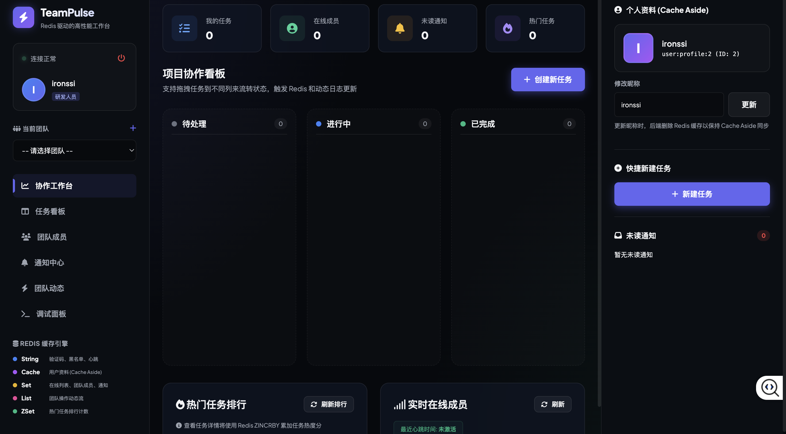

# TeamPulse

TeamPulse 是一个基于 GoFrame、MySQL 和 Redis 的团队协作后端练习项目。

它模拟公司内部协作系统中的常见能力：员工注册登录、团队成员管理、在线状态、任务流转、评论协作、通知中心、团队动态流、热门任务排行、关键接口限流和延迟任务提醒。

项目重点不是把 Redis 当主数据库，而是练习 Redis 在真实业务里承担的缓存、TTL 状态、集合、排行榜、计数器、分布式锁和延迟队列能力。

## 前端主页面

当前控制台位于：

```text
http://127.0.0.1:8000/
```



主页面是一个深色 TeamPulse 协作工作台，登录后展示：

- 左侧：当前会话、团队选择、导航菜单和 Redis 能力图例
- 中间：任务指标、项目协作看板、任务看板、热门任务排行和在线成员
- 右侧：个人资料 Cache Aside 展示、快捷新建任务、未读通知
- 任务详情抽屉：任务编辑、状态流转和详情查看
- 调试面板：展示请求、响应和对应 Redis key

前端通过统一 `request()` 函数适配 GoFrame `ghttp.MiddlewareHandlerResponse` 的标准响应格式：

```json
{
  "code": 0,
  "message": "OK",
  "data": {}
}
```

因此登录接口返回的 `data.token` 会被正确解包，前端保存 JWT 后隐藏登录遮罩并进入工作台。

## 功能概览

- 用户注册、登录、JWT 鉴权和退出登录
- 登录验证码 TTL 存储
- 用户资料缓存
- 团队创建、添加成员和成员缓存
- 团队在线成员心跳与查询
- 任务创建、查询、编辑、状态流转和热门排行
- 任务点赞、取消点赞和点赞状态查询
- 任务评论、评论列表、评论动态和提及通知
- 任务指派通知、任务状态变化通知、评论通知和提醒通知
- 通知列表、未读数和标记已读
- 团队操作动态流
- 创建任务限流和登录限流
- 任务详情缓存穿透、缓存失效、TTL 随机抖动和缓存击穿互斥重建
- 通用 Redis 分布式锁工具
- 任务延迟提醒：ZSet 写入、到期扫描、后台 scanner 和 scanner 分布式锁
- 通知重试队列：List 入队、FIFO 出队、后台 worker 和 worker 分布式锁
- 控制台前端页面，位于 `resource/public`

## Redis 使用点

| 能力 | Key | 类型 | 说明 |
| --- | --- | --- | --- |
| 登录验证码 | `auth:captcha:{username}` | String | 5 分钟 TTL |
| JWT 退出黑名单 | `jwt:blacklist:{token}` | String | TTL 与 token 有效期配合 |
| 用户资料缓存 | `user:profile:{userId}` | String(JSON) | Cache Aside |
| 团队成员缓存 | `team:members:{teamId}` | Set | 缓存团队成员 ID |
| 用户在线状态 | `presence:user:{userId}` | String | 60 秒心跳 TTL |
| 团队在线候选成员 | `presence:team:{teamId}` | Set | 查询在线成员时过滤失效心跳 |
| 团队动态流 | `team:activities:{teamId}` | List | 最近团队操作 |
| 热门任务排行 | `team:task:hot:{teamId}` | Sorted Set | 任务浏览和操作热度 |
| 任务点赞集合 | `task:likes:{taskId}` | Set | 成员是 userId，天然去重 |
| 通知未读集合 | `notification:unread:{userId}` | Set | 成员是 notificationId |
| 通知重试队列 | `notification:retry:queue` | List | 失败通知 payload，FIFO 重试 |
| 任务详情缓存 | `task:detail:{taskId}` | String(JSON / `__NULL__`) | Cache Aside、空值缓存、TTL 抖动 |
| 任务详情互斥锁 | `lock:task:detail:{taskId}` | String NX | 防止热点缓存击穿 |
| 任务提醒队列 | `task:reminder` | Sorted Set | score 为提醒时间戳，member 为 taskId |
| 提醒扫描锁 | `lock:task:reminder:scanner` | String NX | 多实例下避免重复扫描提醒 |
| 通知重试 worker 锁 | `lock:notification:retry:worker` | String NX | 多实例下避免重复处理重试队列 |
| 创建任务限流 | `rate:task:create:{userId}:{minute}` | String Counter | 每用户每分钟最多 10 次 |
| 登录限流 | `rate:login:{ip}:{minute}` | String Counter | 每 IP 每分钟最多 5 次 |

## 技术栈

- GoFrame v2
- MySQL
- Redis
- JWT
- bcrypt
- GoFrame DAO

## 本地启动

1. 复制配置文件。

```bash
cp manifest/config/config.example.yaml manifest/config/config.yaml
cp hack/config.example.yaml hack/config.yaml
```

2. 修改本地 MySQL、Redis 和 JWT 配置。

```yaml
database:
  default:
    link: "mysql:root:password@tcp(127.0.0.1:3306)/redis_forge"

redis:
  default:
    address: 127.0.0.1:6379
    db: 1

jwt:
  secret: "change-me-in-local-config"
  issuer: "redis-forge"
```

3. 启动服务。

```bash
go run main.go
```

默认服务地址：

```text
http://127.0.0.1:8000
```

OpenAPI 文档：

```text
http://127.0.0.1:8000/swagger
```

控制台页面：

```text
http://127.0.0.1:8000/
```

## 测试

运行全部测试：

```bash
go test ./... -count=1
```

当前重点测试覆盖：

- JWT 生成与解析
- 任务编辑权限和副作用
- 任务状态通知创建规则
- 工单评论、提及通知和负责人评论通知
- 任务详情缓存、缓存穿透、缓存击穿和分布式锁
- 延迟提醒设置、到期扫描、后台 scanner 和 scanner 分布式锁
- 任务点赞、取消点赞、点赞状态和 Redis Set 去重
- 通知重试队列、FIFO 出队、后台 worker 和 worker 分布式锁
- 创建任务限流
- 登录限流

部分测试会访问本地 MySQL 和 Redis，并在结束时清理测试产生的 Redis key、通知、动态或任务副作用。

## API 快速演示

下面命令展示主流程。实际账号、验证码、团队 ID 和任务 ID 请以本地数据为准。

### 获取验证码

```bash
curl -s -X POST 'http://127.0.0.1:8000/auth/captcha' \
  -H 'Content-Type: application/json' \
  -d '{"username":"test001"}'
```

### 登录并保存 Token

```bash
TOKEN=$(curl -s -X POST 'http://127.0.0.1:8000/auth/login' \
  -H 'Content-Type: application/json' \
  -d '{"username":"test001","password":"123456","captcha":"验证码"}' \
  | jq -r '.data.token')
```

### 创建团队

```bash
curl -s -X POST 'http://127.0.0.1:8000/teams' \
  -H "Authorization: Bearer ${TOKEN}" \
  -H 'Content-Type: application/json' \
  -d '{"name":"研发协作组"}'
```

### 添加团队成员

```bash
curl -s -X POST 'http://127.0.0.1:8000/teams/1/members' \
  -H "Authorization: Bearer ${TOKEN}" \
  -H 'Content-Type: application/json' \
  -d '{"userId":2,"role":"member"}'
```

### 上报在线心跳

```bash
curl -s -X POST 'http://127.0.0.1:8000/presence/heartbeat' \
  -H "Authorization: Bearer ${TOKEN}" \
  -H 'Content-Type: application/json' \
  -d '{"teamId":1}'
```

### 创建任务

```bash
curl -s -X POST 'http://127.0.0.1:8000/teams/1/tasks' \
  -H "Authorization: Bearer ${TOKEN}" \
  -H 'Content-Type: application/json' \
  -d '{"title":"接入通知中心","description":"完成任务通知链路","assigneeId":2,"priority":2}'
```

### 更新任务状态

```bash
curl -s -X PATCH 'http://127.0.0.1:8000/tasks/1/status' \
  -H "Authorization: Bearer ${TOKEN}" \
  -H 'Content-Type: application/json' \
  -d '{"status":"doing"}'
```

### 查询通知和未读数

```bash
curl -s 'http://127.0.0.1:8000/notifications' \
  -H "Authorization: Bearer ${TOKEN}"

curl -s 'http://127.0.0.1:8000/notifications/unread-count' \
  -H "Authorization: Bearer ${TOKEN}"
```

### 标记通知已读

```bash
curl -s -X PATCH 'http://127.0.0.1:8000/notifications/1/read' \
  -H "Authorization: Bearer ${TOKEN}"
```

### 创建评论并提及成员

```bash
curl -s -X POST 'http://127.0.0.1:8000/tasks/1/comments' \
  -H "Authorization: Bearer ${TOKEN}" \
  -H 'Content-Type: application/json' \
  -d '{"content":"这个任务需要同步一下进度","mentionUserIds":[2]}'
```

### 查询任务评论

```bash
curl -s 'http://127.0.0.1:8000/tasks/1/comments' \
  -H "Authorization: Bearer ${TOKEN}"
```

### 设置任务提醒

`remindAt` 使用 Unix 秒级时间戳，必须晚于当前时间。

```bash
curl -s -X POST 'http://127.0.0.1:8000/tasks/1/reminder' \
  -H "Authorization: Bearer ${TOKEN}" \
  -H 'Content-Type: application/json' \
  -d '{"remindAt":1780500000}'
```

提醒写入 Redis：

```redis
ZADD task:reminder 1780500000 1
```

后台 scanner 会定时执行：

```redis
ZRANGEBYSCORE task:reminder -inf now
```

到期后会创建 `task_reminder` 通知，写入负责人未读集合，并从 `task:reminder` 移除该任务。

### 点赞任务

```bash
curl -s -X POST 'http://127.0.0.1:8000/tasks/1/like' \
  -H "Authorization: Bearer ${TOKEN}"
```

### 查询点赞状态

```bash
curl -s -X GET 'http://127.0.0.1:8000/tasks/1/like-status' \
  -H "Authorization: Bearer ${TOKEN}"
```

### 取消点赞

```bash
curl -s -X DELETE 'http://127.0.0.1:8000/tasks/1/like' \
  -H "Authorization: Bearer ${TOKEN}"
```

### 查询团队动态和热门任务

```bash
curl -s 'http://127.0.0.1:8000/teams/1/activities' \
  -H "Authorization: Bearer ${TOKEN}"

curl -s 'http://127.0.0.1:8000/teams/1/tasks/hot' \
  -H "Authorization: Bearer ${TOKEN}"
```

## 限流验证

创建任务限流：

```text
同一用户一分钟内前 10 次创建任务成功，第 11 次返回“请求过于频繁，请稍后再试”。
```

登录限流：

```text
同一 IP 一分钟内前 5 次登录请求继续进入原登录逻辑，第 6 次返回“登录过于频繁，请稍后再试”。
```

## 通知重试队列验证

通知重试使用 Redis List：

```text
key: notification:retry:queue
入队: RPUSH notification:retry:queue payload
出队: LPOP notification:retry:queue
```

后台 worker 每 5 秒尝试处理一条重试通知，并用分布式锁避免多实例重复处理：

```redis
SET lock:notification:retry:worker token NX EX 4
```

手工验证时可以写入一条 payload：

```bash
redis-cli -n 1 RPUSH notification:retry:queue '{
  "receiverId": 2,
  "actorId": 0,
  "notificationType": "task_reminder",
  "content": "notification retry worker test",
  "relatedTaskId": 2,
  "retryCount": 0
}'
```

worker 消费后会创建 MySQL 通知，并将通知 ID 写入 `notification:unread:{receiverId}`。

## 延迟提醒验证

延迟提醒使用 Redis Sorted Set：

```text
key:    task:reminder
score:  remindAt
member: taskId
```

后台 scanner 由服务启动时创建的 goroutine 定时执行。多实例场景下，scanner 每轮会先尝试获取分布式锁：

```redis
SET lock:task:reminder:scanner token NX EX 4
```

拿到锁的实例执行扫描，拿不到锁的实例跳过本轮，避免重复提醒。

## 开发路线

完整路线和每日进展记录见：

```text
docs/PROJECT_ROADMAP.md
```

## 安全说明

- `manifest/config/config.yaml` 和 `hack/config.yaml` 是本地配置文件，不应提交真实密码。
- 示例验证码接口会直接返回验证码，只用于学习和本地测试。
- JWT secret 请在本地配置中替换，不要使用示例值部署。
